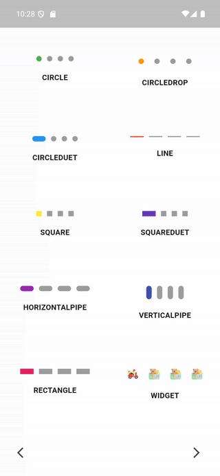

A simple widget to display indicators embedded with different styles.
## Preview Demo


## Usage
Two required arguments are the current and totalCount.
Pass the current index to the argument "current" and your total length to the argument "totalCount".
You can change the indicator style using the argument "style".

## Import Package
```dart
import 'package:knight_page_indicator/indicator_style.dart';
import 'package:knight_page_indicator/indicator_attributes.dart';
import 'package:knight_page_indicator/knight_page_indicator.dart';
```

## Basic Indicator Style
```dart
IndicatorLayout(
  style: IndicatorStyle.circle,
  attribute: BasicIndicatorAttributes(),
  current: yourCurrentIndex(),
  totalCount: yourLength()
);
```

## Basic Indicator Attributes
| Attributes                  | Type        | Description                                             |
|-----------------------------|-------------|---------------------------------------------------------|
| `unselectedBackgroundColor` | Color?      | Background color of the unselected / default indicator. |
| `selectedBackgroundColor`   | Color?      | Background color of the selected / focused indicator.   |
| `unselectedBorderColor`     | Color?      | Border color of the unselected / default indicator.     |
| `selectedBorderColor`       | Color?      | Border color of the selected / focused indicator.       |
| `borderSize`                | double?     | Border size of the indicator.                           |
| `size`                      | double?     | Size of the indicator.                                  |
| `animationDuration`         | Duration?   | Transition duration between indicators.                 |


## Widget Indicator Style
```dart
IndicatorLayout(
  style: IndicatorStyle.widget,
  attribute: WidgetIndicatorAttributes(),
  current: yourCurrentIndex(),
  totalCount: yourLength()
);
```

## Widget Indicator Attributes
| Attributes          | Type      | Description                                   |
|---------------------|-----------|-----------------------------------------------|
| `unselectedWidget`  | Widget    | Widget of the unselected / default indicator. |
| `selectedWidget`    | Widget    | Widget of the selected / focused indicator.   |
| `size`              | double?   | Size of the indicator.                        |
| `animationDuration` | Duration? | Transition duration between indicators.       |


## Author
This plugin is developed by **Atirek Pothiwala**.
<p>
  <a href="https://atirek-pothiwala.github.io/portfolio">
    Visit My Portfolio
    
  </a>
</p>